#  Recorridos de Árboles Binarios - Estructura de Datos

**Universidad Técnica de Ambato**  
**Facultad:** Ingeniería en Sistemas, Electrónica e Industrial  
**Carrera:** Ingeniería de Software  
**Asignatura:** Estructura de Datos, Ing. José Caiza Mg.  
**Curso:** Tercero "B"  
**Alumno:** Nata Alexis  

---

## Objetivo general

Implementar y analizar los principales recorridos de árboles binarios utilizando C++ y Java, aplicando estructuras de datos dinámicas, recursividad y colas.

## 📚 Objetivos específicos

1. Desarrollar la estructura de un árbol binario en C++ y Java, comprendiendo cómo se organizan y enlazan los nodos mediante memoria dinámica para representar jerarquías de datos.
2. Aplicar los distintos tipos de recorridos (Preorden, Inorden, Postorden y BFS) utilizando recursividad y cola, analizando su comportamiento y diferencias.
3. Relacionar el uso de los recorridos con un caso práctico **SmartCampus UTA**, interpretando su utilidad en la organización de información dentro de un sistema real.

---

## 📖 Introducción

Las estructuras de datos son fundamentales en el desarrollo de software, ya que permiten organizar y gestionar la información de manera eficiente. Dentro de estas, los **árboles binarios** destacan por su capacidad para representar datos jerárquicos, facilitando operaciones como búsqueda, inserción y recorrido.

En esta práctica se implementaron los principales recorridos de árboles binarios: los recorridos en profundidad **(DFS)** — Preorden, Inorden y Postorden — y el recorrido en amplitud **(BFS)**, usando los lenguajes **C++** y **Java**. El proceso fue documentado con Git y GitHub, con commits descriptivos de cada etapa del desarrollo.

---

## 📋 Resultados de aprendizaje

Al finalizar la práctica, el estudiante es capaz de:

1. Explicar la diferencia entre recorridos DFS y BFS.
2. Implementar recorridos Inorden, Preorden y Postorden con recursividad.
3. Implementar BFS usando una cola.
4. Comparar la implementación en C++ y Java.
5. Aplicar recorridos de árboles a un caso real del proyecto final.

---

## 📁 Contenido del repositorio

| Carpeta | Descripción |
|---|---|
| `src/cpp/` | Implementación completa de los recorridos en C++ |
| `src/java/` | Implementación completa de los recorridos en Java |
| `docs/` | Guía práctica |
| `exercises/` | Ejercicios |
| `moodle/` | Banco de preguntas tipo Moodle |
| `assets/` | Recursos de apoyo |

---

## 🧠 Marco Teórico

### Árboles Binarios
Un árbol binario es una estructura de datos compuesta por un nodo raíz y dos subárboles (izquierdo y derecho). Cada nodo contiene datos y referencias a sus subárboles, permitiendo representar jerarquías de datos y facilitar su acceso ordenado.

### Nodos y estructuras
Un **nodo** es la unidad básica del árbol, contiene un valor y referencias a sus hijos. El nodo principal se llama **raíz** y los nodos sin hijos se denominan **hojas**.

### Recorridos DFS (Depth First Search)
Exploran cada rama hasta llegar al nodo más profundo antes de retroceder. Se implementan mediante **recursividad**.

### Recorridos BFS (Breadth First Search)
Visita los nodos **nivel por nivel** desde la raíz, usando una **cola (FIFO)** como estructura auxiliar.

---

## 🔄 Reglas de recorrido

| Recorrido | Orden de visita |
|---|---|
| **Inorden** | Izquierda → Raíz → Derecha |
| **Preorden** | Raíz → Izquierda → Derecha |
| **Postorden** | Izquierda → Derecha → Raíz |
| **BFS** | Nivel por nivel usando cola (FIFO) |

---

## 🛠️ Herramientas utilizadas

| Herramienta | Uso |
|---|---|
| **C++** | Implementación de recorridos con memoria dinámica y punteros |
| **Java** | Implementación orientada a objetos con gestión automática de memoria |
| **Visual Studio Code** | Entorno de desarrollo para C++ y Java |
| **Git** | Control de versiones y seguimiento de cambios |
| **GitHub** | Almacenamiento del repositorio en línea |
| **GitBash** | Ejecución de comandos Git desde terminal |
| **Compilador g++** | Compilación y ejecución del código C++ |
| **Java JDK** | Compilación y ejecución de programas Java (javac + JVM) |

---

## ⚙️ Ejecución en C++

```bash
cd src/cpp
g++ main.cpp -o recorridos
./recorridos
```

## ☕ Ejecución en Java

```bash
cd src/java
javac Main.java
java Main
```

---

## 📊 Resultados obtenidos

### Repositorio en GitHub
Se creó el repositorio **"Recorrido_Arboles_Binarios"** en GitHub, organizado con carpetas para código fuente, documentación y recursos. Incluye archivos `.gitignore` y `README.md`.


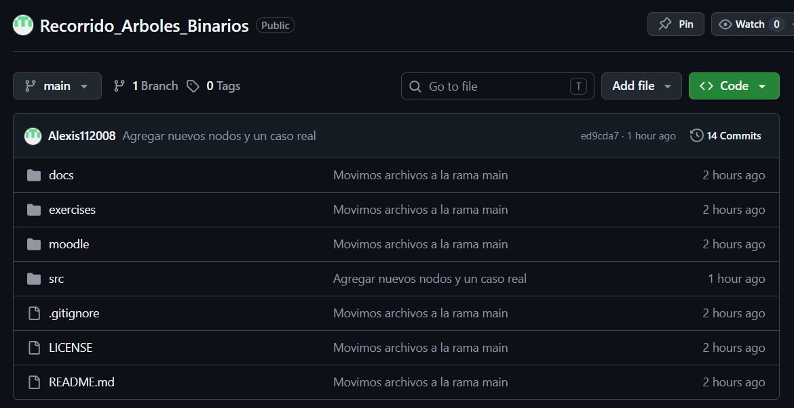

---

### Historial de Commits
Se realizaron **14 commits** en total, cada uno con una descripción clara del cambio realizado, evidenciando el desarrollo progresivo del proyecto.


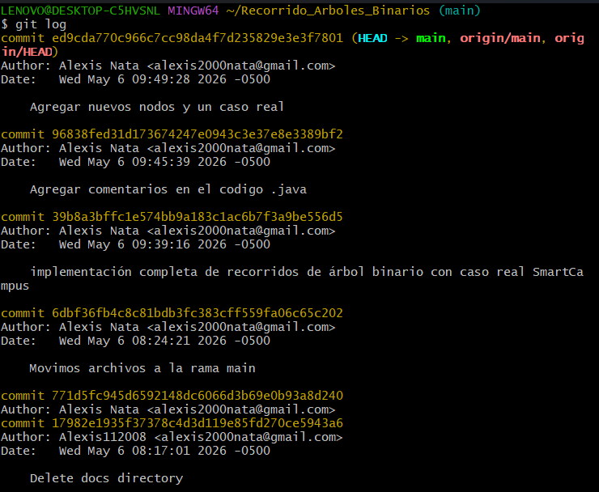
---

### Clonar el repositorio
El repositorio fue clonado con el siguiente comando:

```bash
git clone https://github.com/<usuario>/Recorrido_Arboles_Binarios.git
```


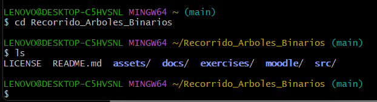
---

### Estructura del proyecto

```
Recorrido_Arboles_Binarios/
│
├── src/
│   ├── cpp/          # Implementación en C++
│   └── java/         # Implementación en Java
├── docs/             # Guía práctica
├── exercises/        # Ejercicios grupales
├── moodle/           # Banco de preguntas
├── assets/           # Recursos adicionales
├── .gitignore
├── LICENSE
└── README.md
```


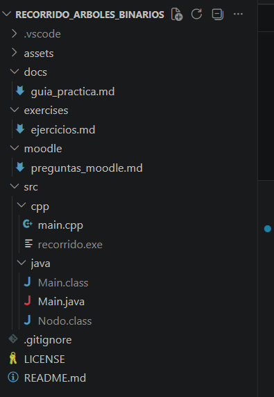

---

### Implementación en C++

**Estructura del Nodo:**  
Se define una `struct Nodo` con un entero `dato` y dos punteros `izquierda` y `derecha`, inicializados en `nullptr`.


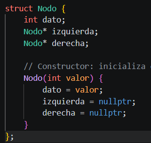

**Recorridos DFS implementados:**
- **Preorden:** Raíz → Izquierda → Derecha. Útil para copias de estructura o representar jerarquía.
- **Inorden:** Izquierda → Raíz → Derecha. Permite obtener datos en orden lógico.
- **Postorden:** Izquierda → Derecha → Raíz. Útil para eliminar o evaluar nodos.


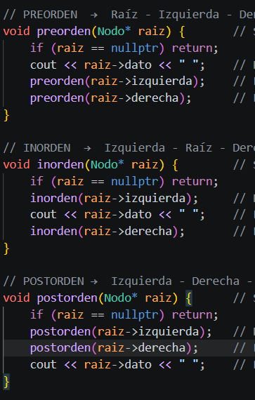

**Recorrido BFS:**  
Usa una `queue` de la STL para recorrer el árbol nivel por nivel (FIFO).


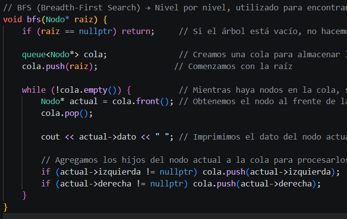

**Función main:**  
Construye el árbol manualmente, agrega nodos adicionales para mayor complejidad, y ejecuta los cuatro recorridos.


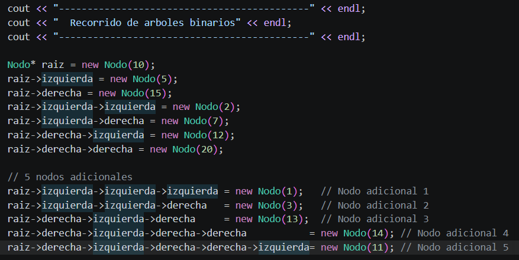

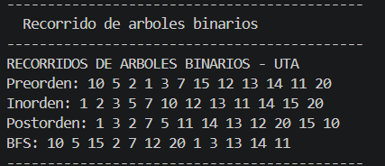

**Caso real — SmartCampus UTA (C++):**  
Se modela el sistema de trámites de la UTA (matrícula, retiros, becas, pagos, cambio de carrera, convalidación, apelación, revisión de exámenes, certificados) como árbol binario y se aplican los cuatro recorridos.


Ejecución del caso SmartCampus UTA en C++

**Captura de ejecución C++:**
 

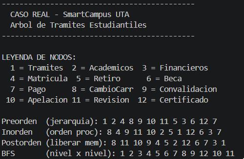

---

### Implementación en Java

**Clase Nodo:**  
Define una clase `Nodo` con un entero `dato` y referencias `izquierdo` y `derecho`, inicializadas en `null`.

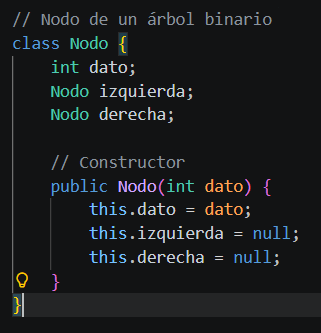

**Recorridos DFS:**
- **Preorden:** Recorre de nivel superior a inferior, manteniendo la jerarquía.
- **Inorden:** Muy útil en árboles de búsqueda (valores en orden ascendente).
- **Postorden:** Procesa hijos antes que el padre; útil para eliminar o evaluar.

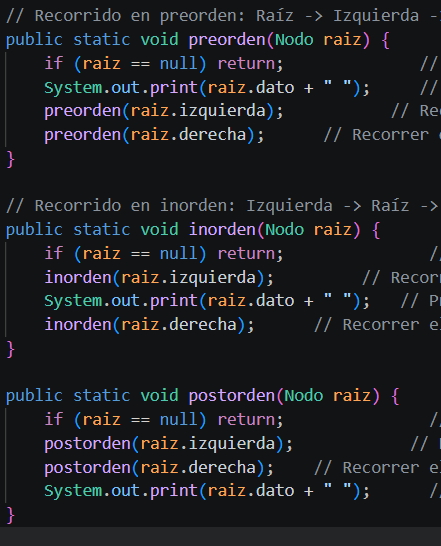

**Recorrido BFS:**  
Usa `Queue` con `LinkedList` para recorrer nivel por nivel.

**Función main:**

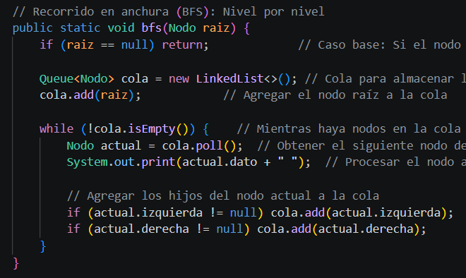

**Caso real — SmartCampus UTA (Java):**

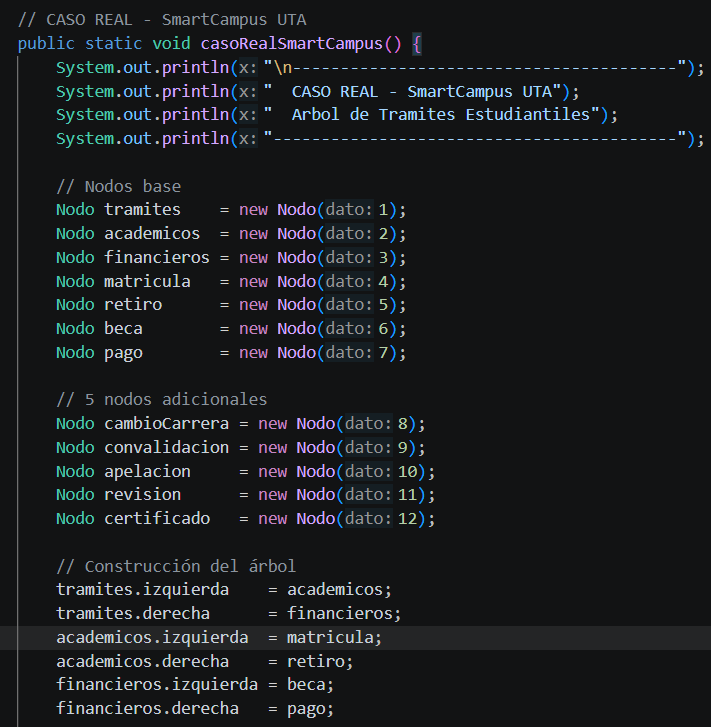

**Capturas de ejecución Java:**

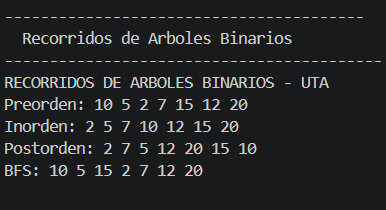
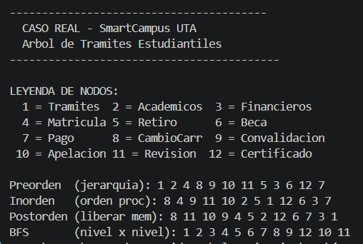

---

## ⚖️ Tabla comparativa C++ vs Java

| Criterio | C++ | Java |
|---|---|---|
| **Manejo de memoria** | Manual (`new` y punteros) | Automático (recolector de basura) |
| **Estructura del nodo** | `struct Nodo` con punteros | `class Nodo` con referencias |
| **Complejidad del código** | Más bajo nivel, más detallado | Más estructurado y limpio |
| **Recursividad en recorridos** | Igual en todos | Igual en todos |
| **Implementación BFS** | `queue` de STL | `Queue` con `LinkedList` |
| **Facilidad de aprendizaje** | Más complejo para principiantes | Más fácil y seguro |
| **Control del sistema** | Mayor control del hardware | Menor control, más abstracto |
| **Seguridad de memoria** | Riesgo con punteros | Más seguro (sin punteros directos) |

> Ambas implementaciones son funcionalmente equivalentes. Java ofrece mayor seguridad y facilidad de manejo de memoria, mientras que C++ proporciona mayor control y eficiencia a nivel del sistema.

---

## ✅ Conclusiones

- Se logró implementar correctamente los recorridos **Preorden, Inorden, Postorden y BFS** tanto en C++ como en Java, aplicando estructuras dinámicas y recursividad.
- Se comprobó que cada recorrido tiene un comportamiento diferente al visitar los nodos, permitiendo analizar la estructura desde distintas perspectivas.
- La aplicación del caso real **SmartCampus UTA** permitió relacionar la teoría con una situación práctica, demostrando el uso de árboles binarios en la organización de información jerárquica.

---

## 💡 Recomendaciones

- Practicar la construcción de árboles binarios más complejos para reforzar la comprensión de los recorridos.
- Comparar otras estructuras de datos (listas, pilas, colas) para identificar cuándo es más eficiente usar árboles binarios.
- Implementar mejoras como liberación de memoria en C++ o interfaces gráficas en Java para una aplicación más completa.

---

## 📌 Actividad sugerida

1. Clonar el repositorio.
2. Ejecutar el código base.
3. Agregar mínimo 5 nodos nuevos.
4. Mostrar los cuatro recorridos.
5. Modificar el caso de aplicación al proyecto final.
6. Subir evidencias al repositorio GitHub del grupo.

---

## 📦 Entregables

- Captura de ejecución en consola.
- Código fuente comentado.
- README del grupo.
- Explicación del caso real.
- Link del repositorio GitHub.

---

## 📝 Rúbrica (sobre 10 puntos)

| Criterio | Puntaje |
|---|---:|
| Implementación correcta de recorridos | 3 |
| Uso correcto de recursividad y cola | 2 |
| Código comentado y organizado | 1.5 |
| Aplicación al proyecto final | 2 |
| Uso de GitHub e IA documentada | 1.5 |
| **Total** | **10** |

---

## 🔗 Repositorio

> **Link:** `https://github.com/Alexis112008/Recorrido_Arboles_Binarios`  


---
