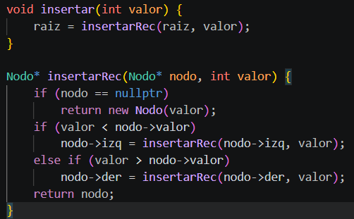
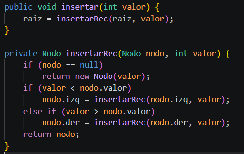
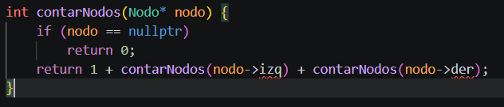
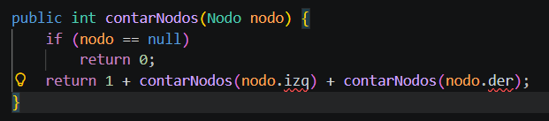
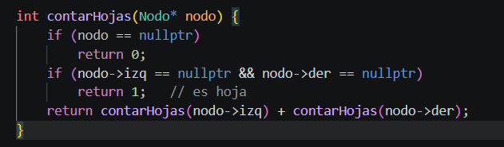
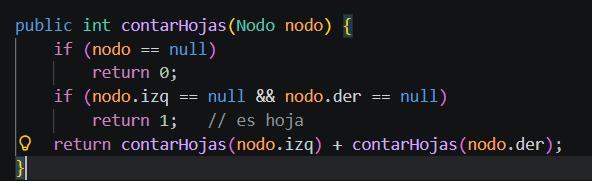

# Ejercicios para clase

## Ejercicio 1
Dado el árbol:

```text
        10
       /  \
      5    15
     / \   / \
    2   7 12 20
```

Escriba manualmente:

- Preorden: 10, 5, 2, 7, 15, 12, 20  
- Inorden: 2, 5, 7, 10, 12, 15, 20  
- Postorden: 2, 7, 5, 12, 20, 15, 10  
- BFS: 10, 5, 15, 2, 7, 12, 20 

## Ejercicio 2
Modifique el árbol anterior agregando los nodos 1, 3, 18 y 25. Ejecute nuevamente los recorridos.

Al agregar los nodos, el árbol se reorganiza manteniendo las reglas del BST.  
Los recorridos cambian según la nueva estructura pero el orden sigue siendo el mismo concepto.

Codigo C++


Codigo Java


## Ejercicio 3
Implemente una función que cuente la cantidad total de nodos del árbol.

Se cuenta recorriendo todo el árbol y sumando cada nodo visitado.  
Es una función recursiva simple que devuelve el total.

Codigo C++


Codigo Java



## Ejercicio 4
Implemente una función que cuente las hojas del árbol.

Se cuentan los nodos que no tienen hijos (hojas).  
Se verifica izquierda y derecha en cada nodo.

Codigo C++


Codigo Java


## Ejercicio 5 aplicado al proyecto final
Represente los módulos de un sistema web como un árbol binario. Ejemplo:

```text
            Sistema Web
           /           \
     Usuarios        Inventario
      /    \          /      \
 Registrar Buscar  Productos Reportes
```

Explique qué recorrido usaría para:

1. Mostrar menú principal: Preorden, porque muestra primero la raíz (Sistema Web).  
2. Procesar módulos internos: Postorden, porque primero ejecuta los submódulos.  
3. Mostrar nivel por nivel: BFS, porque recorre el árbol por niveles usando cola.